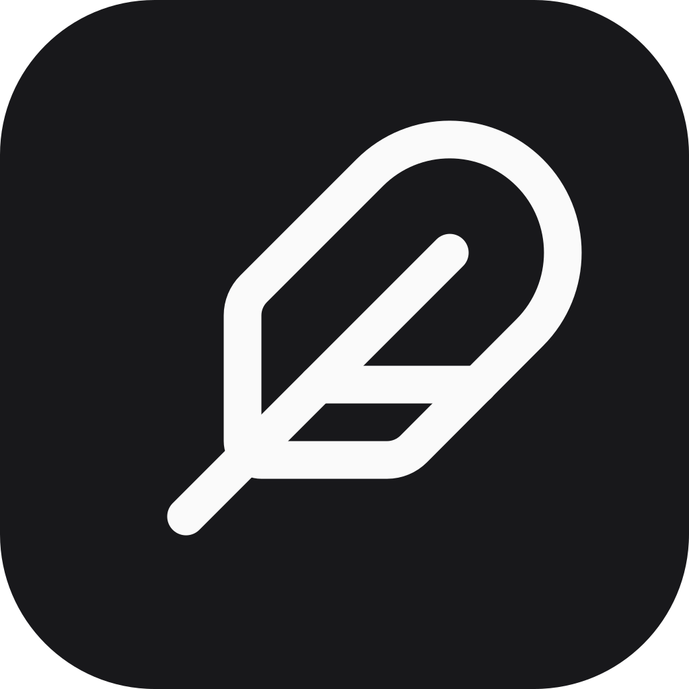
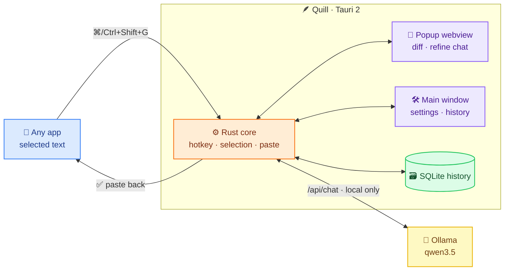

<p align="center">
  
</p>

<h1 align="center">Quill</h1>

<p align="center">
  A local-first writing assistant for macOS and Windows. Select text in any app, press a hotkey, and a small popup shows the corrected version — refine it via chat, then accept to paste it back.<br/>Everything runs on your machine through <a href="https://ollama.com">Ollama</a>; no cloud, no API keys.
</p>

## Features

- **Hotkey popup** — select text, press `Cmd/Ctrl+Shift+G` (rebindable), and Quill opens a popup near your cursor with the fix
- **Actions** — Fix Grammar, Improve, Shorten, Simplify
- **Inline diff** — changes shown as a word-level diff against the original
- **Refine chat** — ask for changes in plain language ("make it more formal") and the result updates in place
- **Safe paste** — the result is pasted back into the app you came from and stays on your clipboard as a fallback
- **History** — accepted changes are stored locally in SQLite (General / Model / History tabs)

## How it works



1. The hotkey handler (Rust) captures your selection and remembers the source app.
2. The text goes to the local Ollama model; the popup renders the result as an inline diff.
3. Accept pastes the result back into the source app and appends the entry to local SQLite.

## Requirements

- macOS 12+ or Windows 10+
- [Ollama](https://ollama.com) installed (Quill starts it automatically if needed; default model: `qwen3.5:4b`)
- macOS: Accessibility permission (Quill reads the selection and pastes the result)

## Development

```sh
bun install
bun tauri dev     # run in dev mode
bun run build     # type-check + bundle the frontend
bun test          # frontend unit tests
```

```sh
cd src-tauri && cargo test   # Rust unit tests (incl. a mock-Ollama server suite)
```

`src/bindings.ts` is generated by [tauri-specta](https://github.com/oscartbeaumont/tauri-specta) on every debug launch — never edit it by hand.

## Stack

<p>
  
  
  
  
  
  
  
  
</p>

Ollama `/api/chat` with `think: false` · settings + history stored locally, never leave the machine.
